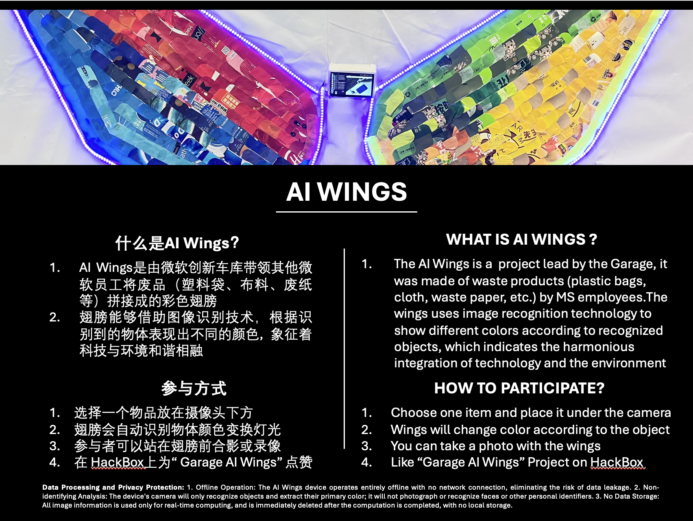
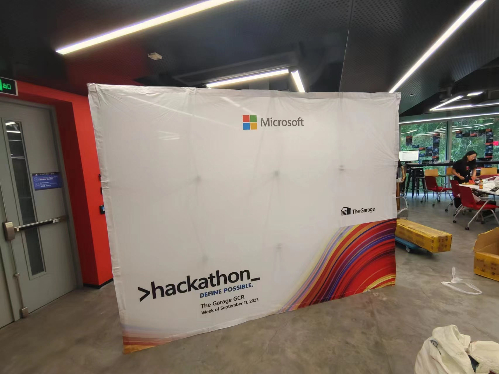
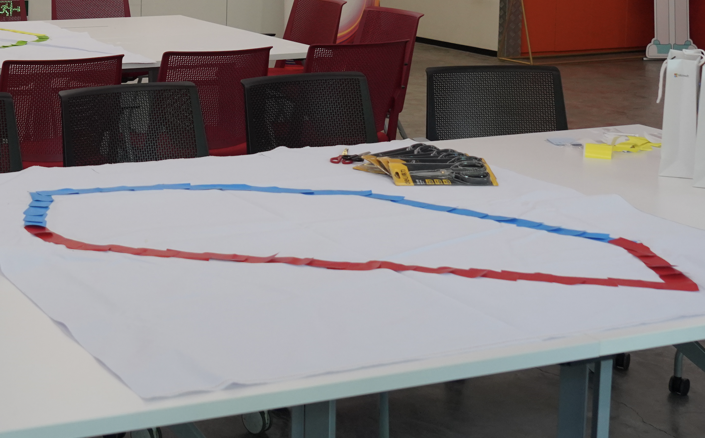
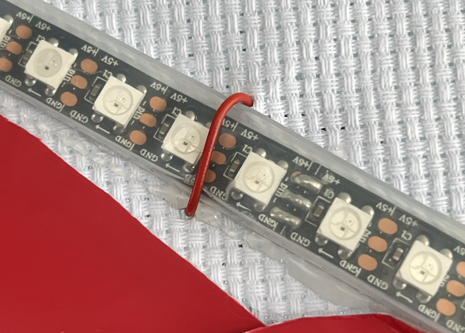

# AI Wings Project

> Hold by the Microsoft Garage GCR for Hackathon 2023


## Brief Introduction




## Meterials

| Item                                              | Number |
| ------------------------------------------------- | ------ |
| 展示架+背景布                                     | 1      |
| microUSB数据线2m                                  | 4      |
| USB充电插头                                       | 4      |
| USB延长线                                         | 2      |
| Jetson亚克力外壳/无线网卡/充电器/跳线帽/风扇/SD卡 | 2      |
| Jetson Nano                                       | 1      |
| Arduino Mega 2560 + 线                            | 1      |
| 灯带（盘）                                        | 2      |
| 电烙铁+焊锡                                       | 1      |
| 轧带（捆）                                        | 2      |
| 7存HDMI显示屏                                     | 1      |
| HDMI数据线2m                                      | 1      |
| USB外接摄像头                                     | 1      |
| 木工胶水（升）                                    | 1      |
| 插线板2m   5孔位                                  | 1      |
| 红外热释电人体传感器                              | 1      |
| 双公头/母转公杜邦线                               | 10     |
| 热熔胶胶枪+10根胶棒                               | 1      |
| 螺丝钉/螺丝刀/剥线钳/老虎钳                       | 1      |
| 细铁丝                                            | 1      |
| 卷尺                                              | 1      |
| 硬纸板                                            | 2      |


## Technical Details

#### Jetson Nano 烧写镜像

>  全文参考 [Get Started With Jetson Nano Developer Kit | NVIDIA Developer](https://developer.nvidia.com/embedded/learn/get-started-jetson-nano-devkit#write)

1. 下载[镜像文件](https://developer.nvidia.com/jetson-nano-sd-card-image)

2. 安装镜像烧录工具[Etcher](https://www.balena.io/etcher)

3. 选择下载的镜像，以及插入至少32GB的SD卡，烧写镜像

   


#### Jetson Nano 开机和基本配置

**推荐使用5V 4A以上的DC电源，为了后续运行的电源消耗**

1. 使用跳线帽，短接 Jetson 主板上的 J48 引脚，确保使用DC供电模式


2. 连接HDMI显示屏，以及键鼠，正常开机进入Ubuntu系统，按照提示完成基本设置。
3. 为了后续运行模型需要，**推荐安装一个PWM 4pin的风扇**。关于风扇调速的设置可以参考https://github.com/Pyrestone/jetson-fan-ctl


#### Jetson Nano环境搭建

1. 安装Conda环境：

   前往 https://github.com/Archiconda/build-tools/releases下载 Archiconda 脚本，直接运行安装

   ```bash
   chmod 777 Archiconda3-0.2.3-Linux-aarch64.sh
   ./Archiconda3-0.2.3-Linux-aarch64.sh
   ```

2. 前往[paddle官方](https://paddleinference.paddlepaddle.org.cn/user_guides/download_lib.html#python)下载编译好的包，对于 Jetson nano 的GPU是`Maxwell`架构，选择`nv_jetson-cuda10.2-trt7-all`或`nv_jetson-cuda10.2-trt7-maxwell`

3. 创建并配置环境：

   ```bash
   # 创建paddle37虚拟环境
   conda create -n paddle37 python=3.7
   conda activate paddle37
   # 安装刚刚下载的paddle whl包，以及其他依赖
   pip3 install paddlepaddle_gpu-2.1.1-cp36-cp36m-linux_aarch64.whl
   pip install requirements.txt
   ```

4. 导出模型

   ```bash
   python tools/export_model.py -c configs/ppyoloe/ppyoloe_plus_crn_t_auxhead_320_300e_coco.yml --output_dir=./inference_model \
                                 -o weights=https://paddledet.bj.bcebos.com/models/ppyoloe_plus_crn_t_auxhead_320_300e_coco.pdparams
   ```

5. 赋予串口`/tty/ACM0`读写权限，用于和 Arduino 通信

   ```bash
   # navigate to rules.d directory
   cd /etc/udev/rules.d
   #create a new rule file
   sudo touch my-newrule.rules
   # open the file
   sudo vim my-newrule.rules
   ```

   在`my-newrule.rules`中填入以下内容

   ```json
   KERNEL=="ttyACM0", MODE="0666"
   ```

​		**最后重启**，完成环境搭建


#### Arduino Mega 2560 配置

1. 电脑下载并安装 [Arduino IDE](https://www.arduino.cc/en/software)

2. 打开Arduino IDE，选择 `Tools` - `Manage Libraries`

   搜索并安装`FastLED`组件

3. 将 Arduino Mega2560 使用USB连接到电脑，烧录程序`./code/LED_with_human.ino`  

   *(根据灯带的部署情况，代码可能需要进行微调)*


### Arduino Mega 2560 接线


1. 将USB连接到 Jetson Nano主板上
2. 灯带的信号控制线连接`6 引脚`，热释电模块连接到`7 引脚`
3. 将灯带的供电和热释电模块的供电线（一般为红色，标记 Vcc）连接到主板`5V 引脚`或者`Vin 引脚`。
4. 将灯带的接地和热释电模块的接地（一般为黑色，标记 GND）连接到主板`GND 引脚`。
5. 在灯带的开头，中间段，以及末尾提供USB供电


## Assembly details

#### **注：需要2-3名Leader全程负责翅膀的整个流程直到布置上线**

1. 取出背景布，平铺在桌面上，布面尺寸 `2.3 m * 3.05 m`。

   

   

2. 勾勒翅膀外观尺寸和硬件电路固定。

   > 推荐人数：8 人（粘贴轮廓 4人， 灯带等硬件 4人 + 2 个Leader）
   >
   > 推荐场次：1 场（该场活动安排在[@MengShi](mailto:v-mengshi@microsoft.com)以及[@Xiang Yu](mailto:v-xiangyu1@microsoft.com)到达的第一天）
   >
   > 推荐时间：60 min

   根据`./utils/wings.png`（1.4m * 2.9 m）用铅笔在布面同比例进行关键点尺寸标定，先在周围粘贴一圈羽毛进行轮廓敲定。然后使用细铁丝加胶带等材料进行灯带的固定，以及电路的布局和固定。

   

   <p align="center">
     &nbsp;&nbsp;&nbsp;
     
   </p>
   

3. **要求参与者携带微软四色（红、绿、蓝、黄）的垃圾袋**，SiteLead 打印翅膀模版文件`./utils/feather.pdf`发给参与者，参与者们按照提供的翅膀模版图片进行剪裁**（不推荐使用塑料袋等薄而易卷的材料）**。

   > 推荐人数：40 人（每颜色10人剪裁翅膀，300片羽毛/颜色，平均每人裁剪30片）
   >
   > 推荐场次：2 场（20人/场）
   >
   > 推荐时间：45 min / 场（5 min讲解，讲解PPT参考[Garage 线下工作坊 亲手制作AI翅膀.pptx (sharepoint.com)](https://microsoft.sharepoint.com/:p:/r/teams/TheGarageBeijing/_layouts/15/Doc.aspx?sourcedoc={BF3407C9-1596-4903-8D87-60C0FF299C23}&file=Garage 线下工作坊 亲手制作AI翅膀.pptx&action=edit&mobileredirect=true&share=IQHJBzS_lhUDSY2HYMD_KZwjAZ7fnG6qvlRCYcBTRel2ibE)）

   - 剪裁完成后，需要**留下8人进行两边翅膀的粘贴工作，SiteLead进行粘贴品控的监督**。

   - 粘贴羽毛时，采用层叠样式，从翅尖到翅根，一片盖一片

   - 翅膀需要加压晾干一天

     

   

4. Leader（组织2-3人）进行最后的组装和维护

   > 推荐人数：2 人
   >
   > 以下内容将会在第一场活动的时候由 Intern 向各个Site的Leader进行具体演示

   - 显示屏安装、固定、接线

   - 灯带接线

   - 电源、启动、开关机

     


### SiteLead ToDo

> 以下问题需要SiteLead配合，提出可行解决方案

- [ ] 展示完毕后的放置和收纳
- [ ] 由谁来接管这套设备，如何收纳
- [ ] 如何将装置利益最大化
